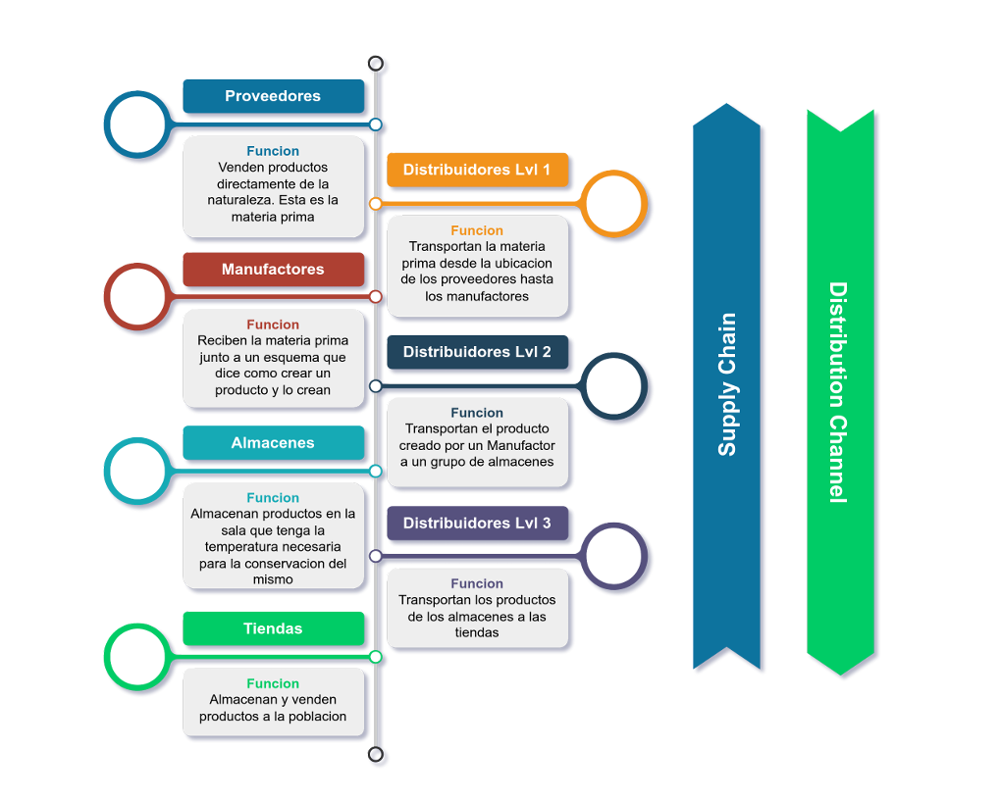

# Proyecto Final de las asignaturas Inteligencia Artificial y Simulación 
## Tema: Cadenas de suministro.

## Integrantes:
- Carla S. Pérez Varela
- Francisco V. Suárez Bellón
- Leismael Sosa
- Lázaro David Alba

# Índice 

-[Introducción](#Introducción)
-[Definición del problema y objetivos](#definición-del-problema)
-[Nuestras definiciones internas](#como-abordaremos-el-problema)
-[Temas académicos a cumplir](#temas-a-cumplir)

## Introducción
En la actualidad la globalización ha traído consigo el nacimiento de grandes conglomerados industriales
los cuales necesitan satisfacer a un grupo significativamente grande la sociedad de determinados productos
donde dichos consorcios deben tener una línea de suministro que cumpla con cierto nivel de optimalidad y
robustez a cambios aleatorios que puedan alterar su comportamiento. Para ello es conveniente utilizar simulaciones
conociendo el modelo de negocio de estas un conjunto inicial de proveedores y conjuntos de proveedores potenciales
y de proveedores de la competencia, además de conocer como en ciertos momentos puede comportarse la demanda del producto 
bajo a la masa de clientela final, el cual los métodos de optimización clásica no permiten estas flexibilidades 
que son necesarias en la industria cuando de economías de escala y con apretados márgenes de beneficio se habla y que 
con datos obtenidos a través de simulaciones podemos estimar que tan eficiente y adecuada es dicha cadena. 
El modelo de negocio es de un amplio espectro, desde la industria automotriz, la aeroespacial (conocida
por la necesidad de una gran sincronización en esta dado la magnitud de sus pedidos y la rigurosidad de la calidad de las piezas), 
la fabricación de textiles o productos tecnológicos hasta las cadenas de comida rápida, este último será nuestro modelo
a escoger.

## Definición del problema.
Las cadenas de comida rápida son mundialmente conocidas por satisfacer un alto volumen de clientes y tener 
un alto número de establecimientos donde es fácil reconocer grandes firmas como McDonald's o BurgerKing. Estas deben 
de alimentar un gran número de clientes en diversidad de establecimientos dispersos. Dado la magnitud de estas es muy 
complejo que para un producto componente de algo en carta de oferta sea suministrado por un único proveedor, por ejemplo
la carne molida para una BigMac en un mismo establecimiento puede ser suministrada por uno o varios proveedores
de donde estos dado el volumen que manejan, además de las condiciones de la economía deben de abastecerse de uno o más
suministradores primarios de carne, así como de empresas logísticas para su desplazamiento. Algo que es seguramente conocido
es la cadena de suministro óptima que tiene McDonald's en una ciudad en concreto; pero dada esta queremos comprobar que tan 
resistente es ante eventos como puede ser un concierto multitudinario, una crisis local, o fallos en suministradores intermedios
un cambio repentino del gusto de los consumidores como puede ser una campaña agresiva de la competencia o algún desafortunado incidente
como la pérdida temporal de la confianza en un local o la firma por algún evento como puede ser que hayan ratas en un establecimiento
o un escándalo de proporciones épicas sobre la marca comercial. Ante esto queremos dar resultados sobre dado una cadena inicial,
su comportamiento ante un grupo de eventos esperados con cierta probabilidad, que tanto puede afectar económicamente la empresa
si dicha cadena a través de la retroalimentación puede ajustarse para ser menos vulnerable a estos, que cantidad de clientes potenciales 
perder, cuanto stock puede ser necesario para dichos eventos, como podemos establecer parámetros para hacer los picos de oferta y
demanda más suaves.

### Factores a tener en cuenta:
##### Estos factores son bajo el modelo de negocio sin aplicar reducciones ni abstracciones.
 El nivel de clientela en un establecimiento puede ser influenciado por varios factores:
- Eventos deportivo, cultural, religioso o de cualquier otra índole
- Intereses turísticos, temporales o permanentes
- Población susceptible bajo los siguientes criterios:
  - Edad
  - Poder adquisitivo
  - Gustos culinarios
  - Influencia social
  - Razones indescriptibles del individuo
- Eventos inesperados:
  - Conflictos bélicos
  - Desastres meteorológicos y humanos
  - Crisis económicas
  - Campañas comerciales en contra de la empresa matriz a investigar
  - Incidentes en la empresa matriz o comercio

Establecer acuerdos entre suministradores se tendrá en cuenta bajo los siguientes criterios:
- Producto/s a vender 
- Mejor proveedor en cuanto distancia
- Mejor proveedor para un producto
- Temperatura y humedad dentro de la empresa
- Confianza hacia el proveedor
- Grado de lealtad
- rango de calidad
- Rango de precios
- Rango de ingresos
- Rango de ganancias en un tiempo T
- White and Black List de productos y proveedores

## Como abordaremos el problema:
Comenzaremos hablando sobre las definiciones que tendremos sobre factores clave:

### Cadena de suministro
Una cadena de suministros es una red de empresas que se encuentran involucradas en el proceso de
 creación de un producto por una empresa llamada Empresa Matriz. Este conjunto de empresas
 normalmente se suelen dividir en las siguientes categorías:
- Proveedores: Venden la materia prima necesaria para la creación de cualquier producto. Esta
materia prima viene de la naturaleza.
- Manufactores: Estas empresas pueden asumir 2 roles.
  - El de vender un producto creado por ellos y que es utilizado para la creación de otro producto
  más grande por otra empresa.
  - El de recibir materia prima junto con un esquema que da las instrucciones a seguir para crear
  un nuevo producto a partir de la materia prima.

- Distribuidores(Logística): La función de estas empresas es la de mover productos de una ubicación a otra.
- Almacenes: Son centros donde se pueden almacenar productos. Normalmente estos centros
tienen grupos de habitaciones con distintas temperaturas, condiciones de humedad y capacidad
para que se guarden en ellas los productos alimenticios que necesiten esas condiciones para su
almacenamiento.
- Tiendas: Este es el último eslabón en la cadena de suministros. La función de estas empresas es
 la de vender a la población un conjunto de productos. El dueño de la tienda puede ser la Empresa
 Matriz y solo vender productos de esta, pero puede ser de una empresa aislada que vende
 productos de un conjunto de empresas matrices y cobra por el servicio de venderlo.

### Producto

Como se mencionó anteriormente, el rol de una cadena de suministros es la de identificar cuales serán
 las empresas involucradas en el proceso de creación de un producto, pero no hemos definido que es un
 producto dentro de nuestra simulación.

Nuestra simulación distingue 2 tipos de productos:
- Productos bases o de materia prima: Estos son los productos que crea la naturaleza y son
 vendidos por los proveedores.
- Productos creados por humanos (o manufactores): Estos son los productos resultantes de la
 mezcla de productos bases. Las características de estos nuevos productos son consecuencia de
 las características de los productos bases.

 Las características de los productos bases son:
- Sabor
- Volumen
- Peso
- Propiedades nutritivas
- Temperatura y humedad necesarias para su conservación
- Calidad inicial
- Historial de su tiempo de vida: Esto contiene información de la temperatura y humedad que ha
tenido en distintos intervalos de tiempo, por ejemplo, condiciones durante el transporte, durante el
almacén.

 Los productos creados por manufactores se componen de ingredientes (una forma de decir la cantidad
 que necesitan de un producto dado) tienen una forma de heredar características como las de sabor, las
 nutritivas y la calidad inicial. Las otras características son propias, pero a la hora de venderse adquieren
 unas nuevas proporcionadas por su creador, estas son:
- Estimación de su fecha de vencimiento: Dan una fecha en la cual predicen que la calidad de su
 producto baja a niveles no aptos para su consumo (puede ser un 20%).
- Características de sabor: Estas no tienen que ser las reales, son las que el vendedor dice que
tiene.

 ### Oferta y demanda

Nuestro proyecto tiene 2 tipos de entidades:
- Las empresas
- Los consumidores

Para simular la oferta y demanda primero tenemos que simular un *mercado*. El mercado que
 simularemos es una gran simplificación respecto a los mercados de la vida real, pero aun así tiene la
 suficiente sustancia como para que se asemeje en algo a lo que sucede en la realidad.

Nuestro enfoque es en primeramente simular una población de individuos donde cada uno tendrá las
 siguientes características:
 - Salario - Aquí entra la cantidad de dinero que recibe y en que tiempo lo hace (por hora,
 diariamente, semanalmente, mensualmente, etc.)

- ¿Qué tan tacaño es? - En dependencia de su salario, el precio de un producto
- ¿Cómo es su percepción del sabor? - Esto es simplemente una función que transforma la
 distribución de sabores de un producto en otra distinta, es decir, puede que un producto sea un
20% dulce pero digamos que este individuo en su percepción aumenta en 10% el sabor dulce. De
 aquí que el individuo percibe una distribución de sabor distinta a la que tiene el producto en la
 realidad. (algunos individuos puede que tengan una percepción de sabor igual a la real, es decir,
 que no aumentan o disminuyen ningún sabor).

- ¿Cuáles son sus gustos? - Los gustos aquí se miden en relación a cuál es la distribución de sabor
 que más le apetece a un individuo. Esto es una función que recibe como entrada la percepción de
 sabor del producto y devuelve un valor entre 0 y 1 que dice que tanto le gusta la distribución de
 sabor (1 es que le encanta y 0 es que le desagrada en lo máximo).

- ¿Cuáles son las tiendas o empresas que conoce? - Un individuo puede que conozca solamente 12
 de las 30 tiendas disponibles en la simulación.

- ¿Dónde vive? - Nuestra simulación contará con un mapa. De aquí que la ubicación es un punto en
 el espacio del mapa

- ¿Qué tanta hambre tiene? - Esto influye en la elección del producto que comprará. Aquí tendrá en
 cuenta las propiedades nutritivas de cada alimento junto con su sabor para elegir cuál alimento
 considera mejor para consumir en el momento dado

- ¿Cuál es su tiempo de vida? - El tiempo de vida de este en la simulación. Esto no quiere decir
 "muerte", sino que simplemente sale de la ciudad (se va de viaje o algo así).
 
  
 Estas características de los clientes influirá en su decisión de a qué empresa le va a comprar que
 producto. Esto a su vez influye en el número de ventas que tendrá cada empresa (y cada producto de
 ellas) lo que a su vez influirá en las decisiones que tomará la empresa a la hora de mantener o modificar
 su cadena de suministros.

### Mapa
Para este apartado tendremos en cuenta los siguientes factores:
 - Establecer la relación de distancia entre las distintas empresas, con base en su distancia mínima.
 - Establecer la relación de distancia entre un consumidor y las tiendas, con base en su distancia mínima..

El mapa será un grafo dirigido ponderado que describiremos como 2:
- El grafo que tiene como vértices las empresas y los arcos como la distancia mínima entre estas.
- El grafo bi-partito que lo relaciona a cada consumidor con una o más tiendas.

Nota: Para el caso de las empresas logísticas calcular su precio, este será a través de la distancia minima entre dos empresas.
con base en sus creencias intrínsecas denotará un precio y el tiempo a recorrer, esto permite abstraer.
que dos distribuidores utilizar distintas rutas entre dos empresas o tengan distintos precios para iguales trayectos en iguales condiciones.

## Temas a cumplir:

### Simulación: 

#### Ambiente:

Se tendrá como ambiente un conjunto de empresas y de consumidores, añadido de variables aleatorias, que 
simularán los eventos aleatorios como aumento o disminución de la población de consumidores o un sector de estos en específico.
La desaparición repentina o cambio de un arco entre dos empresas, simulando que puede existir que se corte la comunicación directa entre estos
o que aumente o disminuye el valor de dicho arco, simulando que se está reparando la carretera o que se ha construido un tramo más corto.

#### Agentes:
Los agentes los cuales con base en las creencias que están en las definiciones anteriores tomarán una serie de decisiones ante eventos aleatorios serán:
- Las empresas.
- Los consumidores.

#### Condición de parada de la simulación:
Dado que nos centraremos en la exposición de este en eventos donde se aumenta drásticamente las demandas 
el caso de parada es cuando la desviación estandar de clientes no satisfechos encuentra una meseta en un número X osea no decrece más y pasadas 100 repeticiones extras para asegurar que no se está en un punto de ensilladura.
Esto es dado que nuestro objetivo es conocer que durante un concierto con una cantidad estimada X de aglomeración extra
cuanto es un estimado de la cantidad de perdidas de ventas por los cambios bruscos en la demanda.

### AI:

En el campo de la inteligencia artificial, tenemos varios problemas los cuales le damos solución (sin entrar a nombrar el algoritmo a elegir dado que es probable que pueda cambiar antes de la entrega):
- Búsqueda : a través de ella como puede encontrar del camino y transportista óptimo, para el transporte de carga
como satisfacer las necesidades de suministro dado una demanda de una empresa X.
- Procesamiento del Lenguaje Natural: La utilización de LLM para ingresar el estado inicial de la simulación, como los resultados finales de esta,
dado que queremos que los datos sean comprensibles para alguien que tome decisiones en una empresa y no sea hábil en conocimientos de computación y de análisis estadístico
- Conocimiento ontológico: Dado que el conjunto de conocimientos intrínsecos de los agentes está dado por relaciones por ejemplo para determinar
la lealtad en una misma empresa está determinada por otras entidades ontológicas como la demanda, la credibilidad del cliente, comportamientos internos de esta.
- Modelos Ocultos de Markov: Para determinar la veracidad o no sobre lo que dice un agente a otro, por ejemplo sobre la frescura real de un alimento.

